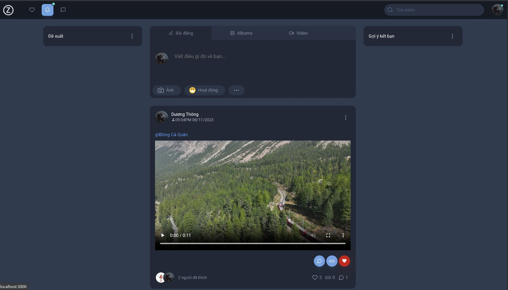
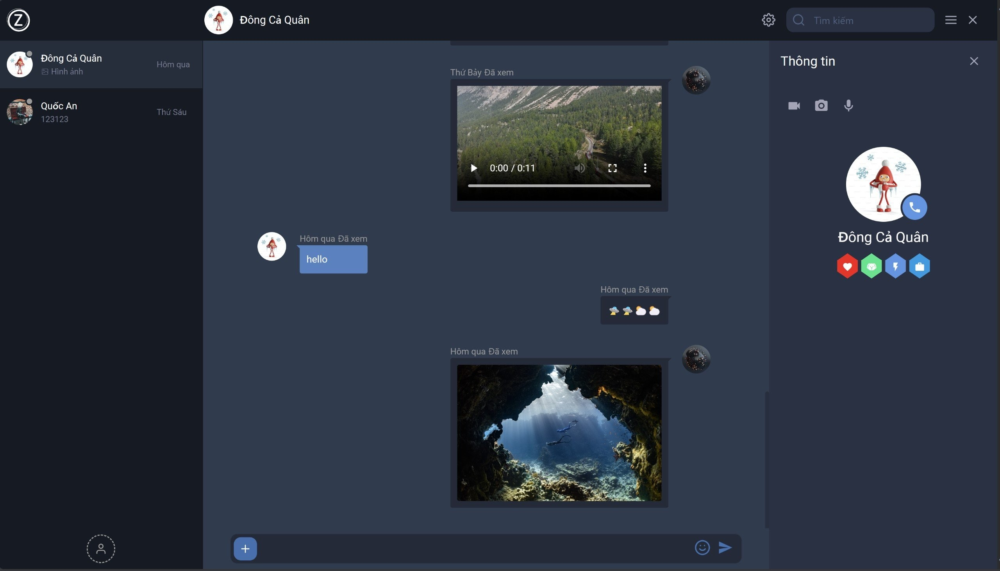

# Giới thiệu dự án Zetavn

Zetavn là một dự án mạng xã hội thu nhỏ nhưng đầy đủ với một loạt các chức năng bao gồm đăng bài, thích, chia sẻ, bình luận, tìm kiếm và kết bạn, nhận thông báo, gửi tin nhắn với đa dạng hình thức như (text, file, emoji), cũng như voice call và video call. Với mục tiêu tạo ra một không gian trực tuyến đa chiều và phong phú, Zetavn cung cấp cho người dùng một trải nghiệm mạng xã hội toàn diện, nơi họ có thể kết nối và tương tác một cách tự do và linh hoạt. Tất cả những tính năng này được tích hợp vào một giao diện thân thiện và dễ sử dụng, giúp người dùng dễ dàng tiếp cận và tận hưởng các chức năng mạng xã hội mà họ mong muốn.

Dự án này là dự án tốt nghiệp của một nhóm sinh viên Cao đẳng FPT Polytechnic. Mục tiêu của dự án này là áp dụng tất cả các kiến thức đã học để chứng minh những gì đã học. Dự án cũng bao gồm các công nghệ mới mà trong quá trình làm đã tìm hiểu. Với sự hỗ trợ và chỉ đạo của các giảng viên, nhóm sinh viên đã đặt mục tiêu cao để tạo ra một sản phẩm mạng xã hội đa chức năng và chất lượng cao, đồng thời thể hiện sự tiến bộ và sự sẵn sàng trong việc thực hiện các dự án phức tạp.

Source code của dự án đã được chia thành hai phần: backend và frontend. Đây là phần frontend của dự án

# Công nghệ sử dụng

Nextjs, Typescript, Redux, Zego cloud, React hook form, Yup, SCSS, Bulma,...

# Các giao diện dự án

### Giao diện người dùng

1. Trang newfeed

2. Trang cá nhân

3. Giao diện chat

4. Giao diện bài đăng

5. Giao diện đăng bài

6. Giao diện đăng nhập

7. Giao diện đăng ký

8. Giao diện quên mật khẩu

9. Giao diện thông báo

10. Giao diện tìm kiếm

11. Giao diện bình luận

